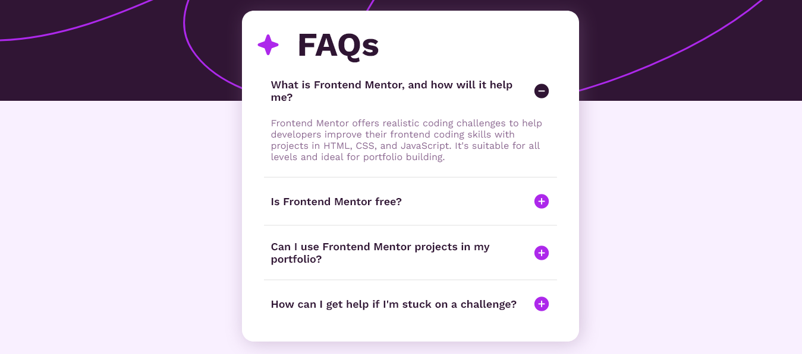

# Frontend Mentor - FAQ accordion solution

This is a solution to the [FAQ accordion challenge on Frontend Mentor](https://www.frontendmentor.io/challenges/faq-accordion-wyfFdeBwBz). Frontend Mentor challenges help you improve your coding skills by building realistic projects.

## Table of contents

- [Overview](#overview)
  - [The challenge](#the-challenge)
  - [Screenshot](#screenshot)
  - [Links](#links)
- [My process](#my-process)
  - [Built with](#built-with)
  - [What I learned](#what-i-learned)
  - [Continued development](#continued-development)
  - [Useful resources](#useful-resources)
- [Author](#author)

## Overview

### The challenge

FAQ accordion

### Screenshot

### Links

- Solution URL:
- Live Site URL:

## My process

### Built with

- Semantic HTML5 markup
- CSS custom properties
- Flexbox
- Mobile-first workflow
- Vanilla JavaScript

### What I learned

To select an element with focus function and the tabindex attribute

### Continued development

To improve my JavaScript performance

### Useful resources

- [Google](https://www.google.com) - This helped me to search for resources.
- [MDN](https://developer.mozilla.org/en-US/docs/Web/API/HTMLElement/focus) - This is an amazing article which helped me finally understand how to focus an element. I'd recommend it to anyone still learning this concept.

## Author

- Website - [Vera](https://github.com/verakissyou17)
- Frontend Mentor - [verakissyou17](https://www.frontendmentor.io/profile/verakissyou17)
